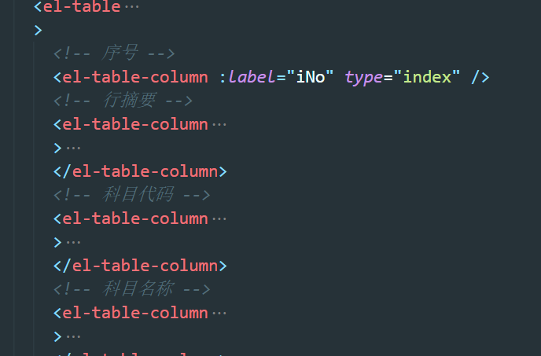
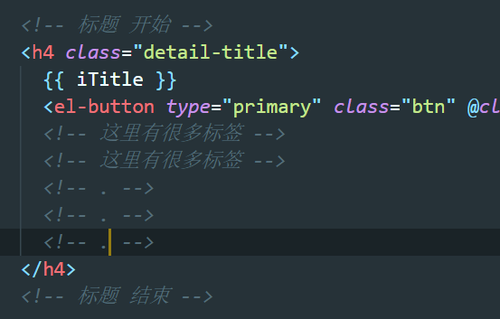

# 前端规范

[](https://github.com/My-job-document/Document/commits/master)

个人认为比较重要的一些规范.

[VUE 官方风格指南][4]


## :dart: HTML-VUE

### 1. 注释

尽可能多的注释.





### 2. 标签的使用

 1. 不使用自定义标签.

	2. 使用前端提供的基础组件. 

	3. 项目中引入了 elment-ui, 页面布局多使用element-ui中的布局标签.

    [参考链接1][1] [参考链接2][2]

    element-ui 中常见的布局标签有:

    	1. `<el-row>`, `<el-col>`: layout布局. 
     	2. `<el-container>`: 外层容器。当子元素中包含 `` 或 `` 时，全部子元素会垂直上下排列，否则会水平左右排列.
     	3. `<el-header>`: 顶栏容器.
     	4. `<el-aside>`: 侧边栏容器.
     	5. `<el-main>`: 主要区域容器.
     	6. `<el-footer>`: 底栏容器.

	4. 标签层级不要太深. 

    遇到标签层级太深的, 抽离除一个子组件. 

### 3. 组件命名

1. 定义vue组件名称的使用注意不要与H5新标签重名.

   ```vue
   // 例: dialog是H5标签, 不要使用`dialog`命名组件.
   <dialog>...</dialog>
   ```

2. 子组件以父组件名称开头.

   例: 父组件: `<SuperTabel>` 子组件: `<SuperTable-col>`


## :dart: JS

### 1. 命名


## :dart: ​CSS


## :dart: ​其他

### 1. 单元测试

自测不合格? 冒烟测试不通过? BUG反复出现? 

推荐在开发过程中编写单元测试. 

### 2. VUE扩展

有些页面基本是一致的, 包括交互逻辑. 

推荐使用 vue 的扩展属性extends. 以及mixins混入开发, 提高代码的重用率.

[mixins选项合并规则][5]

```vue
// A 文件与 B 文件只有加载接口不一致, 其他一致
// B 文件中就可以基于 A 文件扩展
<script>
import A from './A'
import { getTableData } from '../service/tableData'
    
export default {
    name: 'B',
    extends: A,
	methods: {
        load() {
            getTableData().then(/* doSomething */)
        },
    },
}
</script>
```


[1]: https://element.eleme.cn/#/zh-CN/component/layout
[2]: https://element.eleme.cn/#/zh-CN/component/container
[wiki-3]: http://wiki.luckincoffee.com/pages/viewpage.action?pageId=20160363
[4]: https://cn.vuejs.org/v2/style-guide/
[5]: https://cn.vuejs.org/v2/guide/mixins.html